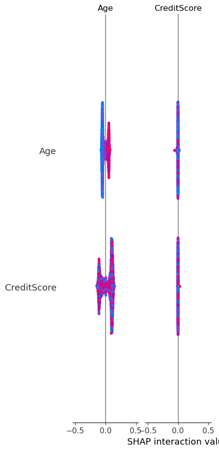

# Customer Churn Prediction
**A machine learning model to predict customer churn using various classification algorithms and SHAP explainability.**


## Table of Contents
- [Introduction](#introduction)
- [Dataset](#dataset)
- [Workflow](#workflow)
- [Installation](#installation)
- [Usage](#usage)
- [Model Performance](#model-performance)
- [Feature Importance](#feature-importance)
- [Next Steps](#next-steps)
- [Contributors](#contributors)

## Introduction
Customer churn is a critical business problem, especially for industries such as banking, telecommunications, and e-commerce. 
This project aims to predict customer churn using various machine learning models and analyze which features influence churn decisions the most.

**Key Objectives:**
- Train machine learning models to classify customers as `Exited` (Churn) or `Remained`.
- Identify key factors leading to churn using **SHAP (SHapley Additive Explanations)**.
- Handle class imbalance using **SMOTE (Synthetic Minority Oversampling Technique)**.
- Compare the performance of multiple classification models.

## Dataset
The dataset used in this project is `Churn_Modelling.csv`, which contains customer details from a bank.

### Key Features:
- **Demographics**: `Geography`, `Gender`, `Age`
- **Financial Information**: `CreditScore`, `Balance`, `NumOfProducts`, `EstimatedSalary`
- **Customer Activity**: `HasCrCard`, `IsActiveMember`, `Satisfaction Score`, `Point Earned`
- **Target Variable**: `Exited` (0 = Stayed, 1 = Churned)

## Workflow
The project follows a structured workflow:

1. **Data Preprocessing**
   - Removing unnecessary features (`RowNumber`, `CustomerId`, `Surname`).
   - Encoding categorical features (`Geography`, `Gender`, `Card Type`).
   - Scaling numerical features using `StandardScaler`.

2. **Handling Class Imbalance**
   - Applying **SMOTE** to balance the `Exited` classes.

3. **Model Training & Evaluation**
   - Training models: **Logistic Regression, Random Forest, SVM, KNN, Decision Tree, Gradient Boosting**.
   - Evaluating accuracy, AUC-ROC, and confusion matrices.

4. **Feature Importance with SHAP**
   - Generating SHAP values to explain which features contribute most to churn.
   - Saving and visualizing SHAP summary plots.

## Installation
Ensure you have Python installed (Python 3.8+ recommended). Run the following commands:

```bash
# Clone the repository
git clone https://github.com/yourusername/customer-churn-ml.git
cd customer-churn-ml

# Create a virtual environment (Optional but recommended)
python -m venv venv
source venv/bin/activate  # On Windows: venv\Scripts\activate

# Install dependencies
pip install -r requirements.txt
```

## Usage
To train models and generate SHAP insights, simply run:

```bash
python customer_churn_ml.py
```

To view the SHAP summary plot:

```bash
python -c "import matplotlib.pyplot as plt; import shap; plt.imshow(shap.summary_plot())"
```

## Model Performance
The following table summarizes the accuracy and AUC-ROC scores of various models:

| Model                | Accuracy | AUC-ROC |
|----------------------|----------|---------|
| **Random Forest**    | **99.85%** | **0.9989** |
| **Logistic Regression** | **99.85%** | **0.9987** |
| **SVM**             | **99.85%** | **0.9968** |
| **KNN**             | **99.80%** | **0.9972** |
| **Decision Tree**    | **99.75%** | **0.9957** |
| **Gradient Boosting**| **99.75%** | **0.9970** |

## Feature Importance
The **SHAP summary plot** below illustrates which features had the most influence on customer churn:



### Key Insights from SHAP:
1. **Age is the strongest predictor** – Older customers are more likely to churn.
2. **Credit Score has a mixed impact** – Lower credit scores are correlated with higher churn.
3. **Number of Products & Active Membership impact churn significantly.**
4. **Satisfaction Score and Loyalty Points also influence customer retention.**

## Next Steps
- **Hyperparameter tuning** to optimize model performance.
- **Deploy the best model** as a web API using **FastAPI or Flask**.
- **Create a dashboard** using Streamlit or Dash for real-time churn predictions.
- **Experiment with deep learning** models like LSTMs for churn forecasting.

## Contributors
👤 **Your Name**  
- GitHub: [yourusername](https://github.com/yourusername)  
- LinkedIn: [Your Profile](https://linkedin.com/in/yourprofile)  

## License
This project is licensed under the **MIT License**.
